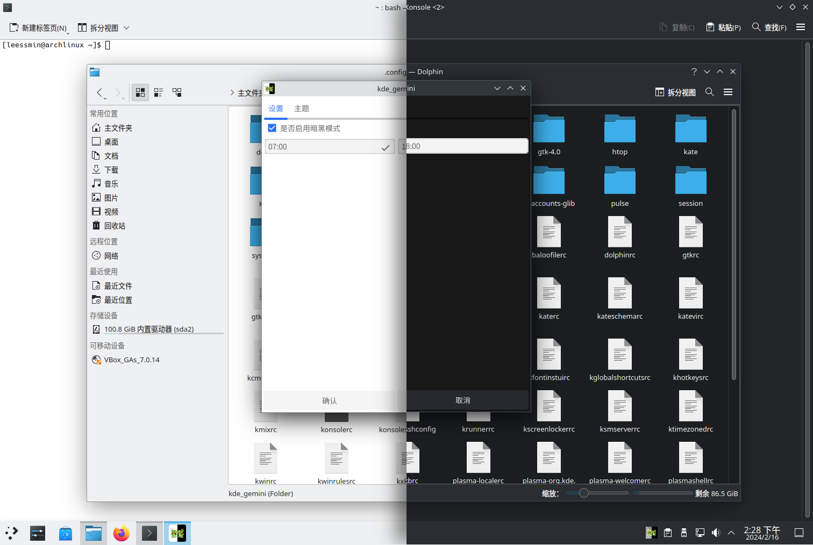

<div align="center">
	

<h1>kde-gemini</h1>

适用于KDE桌面环境的主题切换工具。gemini的中文翻译为双子座，寓意light/dark
</div>



# 安装/卸载
下载 kde_gemini.tar.xz，并解压。解压完成进入文件夹。输入安装命令
```sh
make user-install #全局安装

sudo make install #全局安装
```

卸载可参考MakeFile文件里的操作。或者使用下面的卸载命令命令（需保留MakeFile文件）
```sh
make user-uninstall
sudo make uninstall
```

# 相关项目
[yin-yang](https://github.com/oskarsh/Yin-Yang):适用于Linux的深色主题自动切换工具，支持诸如KDE、Gnome与Budgie等桌面环境以及VSCode、Atom等代码编辑器。

# 鸣谢
- [yin-yang的开源方案](https://github.com/oskarsh/Yin-Yang)
- [fyne为go提供gui界面](https://github.com/fyne-io/fyne)
- [viper提供的配置解析](https://github.com/spf13/viper)

# License
[LGPL-3.0](https://opensource.org/license/lgpl-3-0/)

